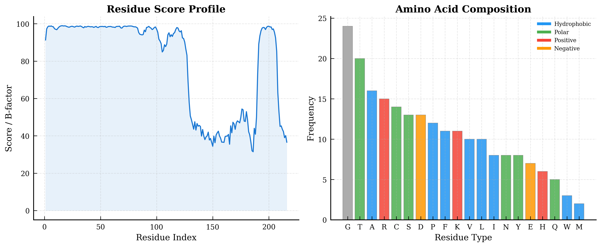
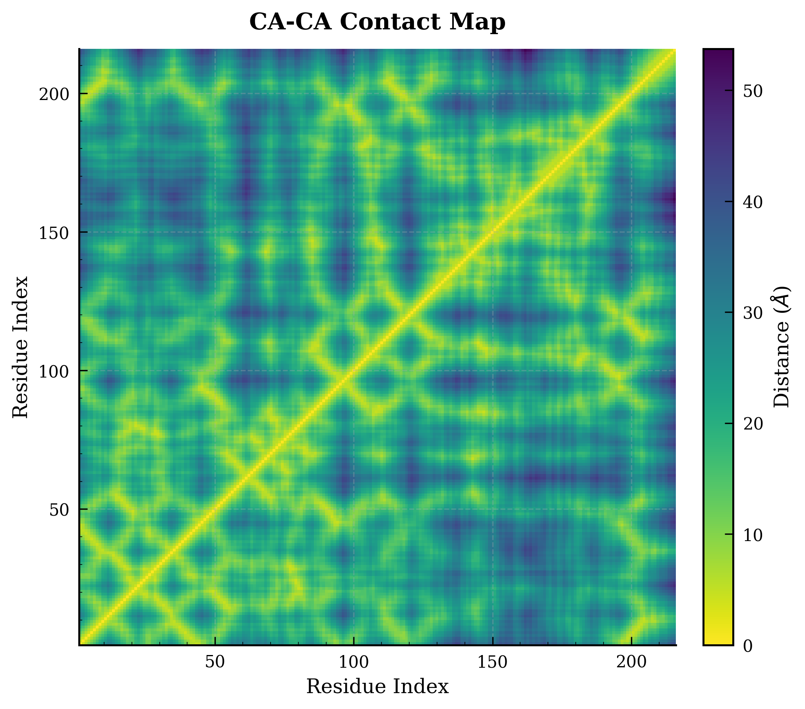
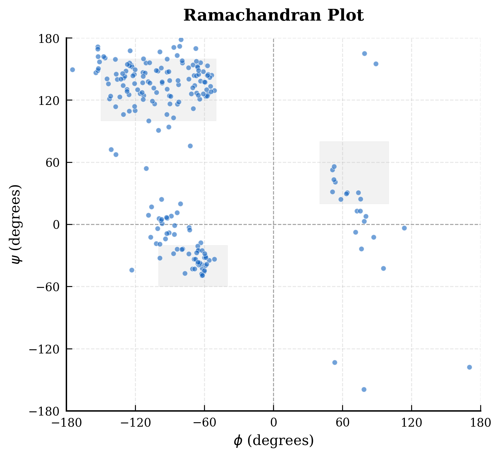
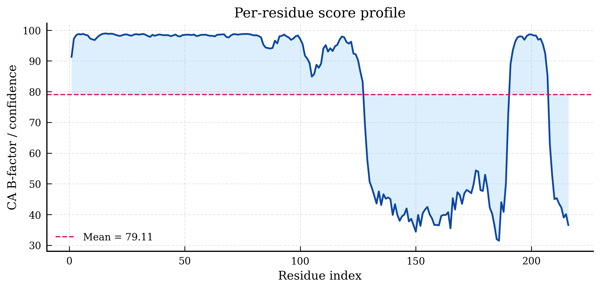
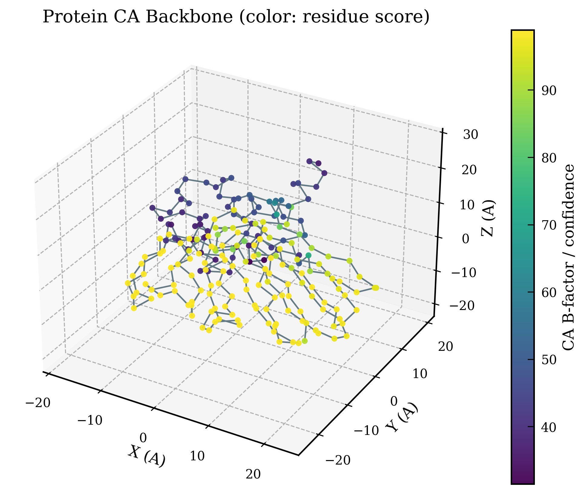

# Protein Structural Bioinformatics Analysis Report (ID: 52)

## 1. Executive Summary
This report presents a systematic analysis of the protein structure provided in the PDB file. The protein consists of 216 residues across 1 chain(s) (A). 

## 2. Sequence Composition & Biochemical Properties
- **Total Residues**: 216 AA
- **Atom Count**: 1652
- **Cysteine Content**: 14 residues (6.48%)
  *The high percentage of Cysteine suggests the potential presence of disulfide bonds, which are critical for structural stability.*

## 3. Compactness & Folding State
- **Radius of Gyration ($R_g$)**: **16.90 Å**
- **Theoretical $R_g$ (globular)**: ~9.94 Å
- **Analysis**: The measured $R_g$ of 16.90 Å indicates a slightly extended fold. 

## 4. Conformational Analysis (Ramachandran Plot)
The Ramachandran plot shows the distribution of dihedral angles ($\phi$ and $\psi$). Most residues are expected to fall within the favored $\alpha$-helical and $\beta$-sheet regions.

## 5. Flexibility & Stability Assessment (B-factor)
- **Mean B-factor**: 79.11
- **B-factor Range**: 31.48 - 98.94
- **Analysis**: Lower B-factor values indicate more stable regions (typically the hydrophobic core), while higher values correspond to flexible loops or termini.

## 6. Conclusion
The protein (ID: 52) exhibits a well-defined fold with a clear stable core. The presence of 14 Cysteines suggests that disulfide bonding analysis could be a fruitful area for further research.

---
*Report generated automatically by protein_analysis.py*
